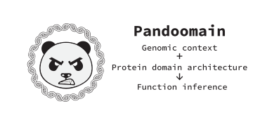
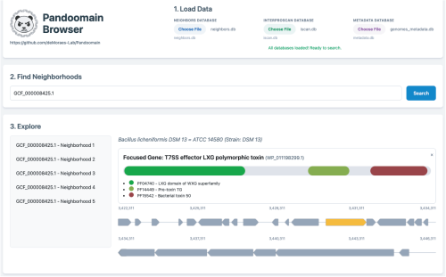

<h1 align="center">  </h1>

<p align="left">
    <a href="https://semver.org/"></a>
   <a href="https://snakemake.github.io/"></a>
    <a href="http://choosealicense.com/licenses/mit/"></a>
</p>
<hr />

# Pandoomain: A scalable pipeline for genomic and protein domain context analysis 

---

## v2.0.0

I recommend using and sending patches
to the upstream version that is at:
https://github.com//deMoraes-Lab/Pandoomain

## Contents

- [Description](#description)
- [Quick Usage](#quick-usage)
- [Inputs](#inputs)
- [Outputs](#outputs)
- [Documentation](#documentation)
- [Installation](#installation)

## Description

*pandoomain* is a [*Snakemake pipeline*](https://snakemake.github.io/) designed for:

- Downloading genomes.
- Searching proteins using *Hidden Markov Models* (HMMs).
- Domain annotation via [`interproscan.sh`](https://github.com/ebi-pf-team/interproscan).
- Extracting protein domain architectures.
- Extracting gene neighborhoods.
- Adding taxonomic information.

This pipeline helps identify functional and evolutionary patterns by analyzing *Protein Domain Architecture* and *Gene Neighborhood* data.

Some biological questions are better approached at the domain level rather than at the raw sequence level. This pipeline extends that idea to entire *Gene Neighborhoods*.


### Domain Representation

*pandoomain* encodes a *domain architecture* as a string, offering several advantages:

- Existing libraries for string distance can be directly applied.
- Easier human inspection of raw tables.
- Enables domain alignments.

The encoding method consists of adding *+33*  to each *PFAM ID* and treating the result as a *Unicode code point*.

The reasons for this are:
- Adding *+33* avoids mapping to control and whitespace charaters,
   using the same idea behind the *Phred33 score*.
- *Unicode* can comfortably accommodate all defined *PFAMs* (*\~16,000*), as it provides *155,063* characters.
   User-defined HMMs could be assigned a *code point* bigger than *18,000* to comfortably dodge any *PFAM ID*.

### Output visualization ###

Pandoomain results can be easily visualized using the HTML GUI interface "Pandoomain Browser".
The interface requires the user to upload the SQL files neighborhood.db, iscan.db, and metadata.db in the HTML file "pandoomain_browser/pandoomain_browser.html".
The user will be able to search for specific genome or protein IDs that will show the respective gene neighborhhod and domains present in the protein.
Below is one example of Pandoomain Browser output.

<h1 align="center">  </h1>


### Pipeline Workflow

The pipeline takes two inputs:

1. A text file with assembly accessions.
2. A directory of *HMMs*.

Then it retrieves genomes (in `.gff` and `.faa` formats), extracts proteins that match any given *HMM*,
annotates them with [`interproscan.sh`](https://github.com/ebi-pf-team/interproscan), and derives *Domain Architectures* at both protein and neighborhood levels.

The final results include taxonomic data for further analysis.


---

## Quick Usage

### Option 1: Using [`config/config.yaml`](config/config.yaml)

Edit `config/config.yaml` and then run:

```sh
snakemake --cores all
```

### Option 2: Using Command-Line Arguments

Run the pipeline with configuration directly on the command line:

```sh
snakemake --cores all \
          --config \
            genomes=genomes.txt \
            queries=queries
```

*Option 1 is recommended* since an edited configuration file acts as a log of the experiment, improving reproducibility. *Option 2* is useful for quick test runs.

Before running anything perform a test run
adding the following options `-np --printshellcmds`
to the `snakemake` command.

---

## Inputs

1. **Genome List**: A text file with no headers, containing one genome assembly accession per line. Example: [`tests/genomes.txt`](tests/genomes.txt).

   - Use `#` for comments.

2. **HMM Directory**: A directory containing `.hmm` files, which can be obtained from the *InterPro database* or manually generated from alignments.

---

## Outputs

The pipeline generates *TSV tables* summarizing:

- *HMM* hits.
- Genome data.
- Taxonomic information.
- Protein domain architectures.

---

## Documentation

For further details check the documentation at [docs/README.md](docs/README.md).

---


## Installation

### Dependencies

The most complex dependency is *interproscan.sh*, so a helper script is included: [`utils/install_iscan.py`](utils/install_iscan.py).

The pipeline runs through the *Snakemake* framework.

### Cloud Installation

For a guide on cloud deployment, see: [deploy-pandoomain](https://github.com/elbecerrasoto/deploy-pandoomain).

### Local Installation

#### 1. Clone the repository

```sh
git clone 'https://github.com/elbecerrasoto/pandoomain'
cd pandoomain
```

#### 2. Install an Anaconda Distribution

I recommend [Miniforge](https://github.com/conda-forge/miniforge). A *Makefile* rule can simplify this step:

```sh
make install-mamba
```

#### 3. Install the Conda Environment

```sh
~/miniforge3/bin/conda init
source ~/.bashrc
mamba shell init --shell bash --root-prefix=~/miniforge3
source ~/.bashrc
mamba env create --file environment.yml
mamba activate pandoomain
```

#### 4. Install InterProScan

```sh
make install-iscan
```

#### 5. Install R Libraries

```sh
make install-Rlibs
```

#### 6. Test the Installation

```sh
make test
```

---

Everything should now be set up and ready to run. 🚀

## Version Changes

### 0.0.2

+ Removal of *hmmer_input rule*.
    + It's simpler to just use the `genomes.tsv` as input for the _hmmer rule_.
+ Removal of preprocessing rule for `genomes.txt`.
    + Now the dependant rules can parse `genomes.txt` directly.
+ Fixed taxallnomy bug, caused by an updated DB.
    + taxallnomy now has 43 cols instead of 42.
+ Removal of utils.py

### 2.0.0

+ Interactive Browser Visualization
    + Introduced a new web-based visualizer (pandoomain-browser.html) allowing users to interactively explore pipeline outputs.
    + The pipeline now automatically generates formatted SQLite database files (iscan.db, metadata.db, neighbors.db) natively supported by the new browser interface.

+ Updated utils/install_Rlibs.R to use pak to install R packages

+ Enhanced Protein Domain Encoding
    + Upgraded the domain architecture encoding system in archs.R to support a massive number of unique protein domains.
    + Replaced the standard single-letter code with a high-stability, high-contrast Unicode pool. Orioritizes geometric shapes and multiple universal alphabets (Latin, Greek, Cyrillic, Armenian, Devanagari) ensuring left-to-right reading stability across massive datasets.

+ Improved InterProScan Execution
    + Rewrote the interproscan execution logic in the Snakemake workflow for increased reliability and performance.
Transitioned from a Python-wrapped execution to a direct bash execution model that efficiently processes chunks of .faa files, with built-in error handling for missing files and failed jobs.


